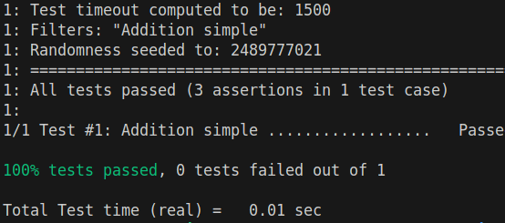

# Clearning

## [STEP 0] Prerequies

To have install make and cmake on your desktop, with ubuntu use :

```sh
sudo apt install make cmake
```

## [STEP 1] Clone repo with submodules

```sh
git clone --recurse-submodules https://github.com/m2gi-deschamt/Clearning.git
```

Or, if you're impatient and have already cloned the system, do the following:

```sh
git submodule update --init --recursive
```

## [STEP 2] Compilation

Go to the root path of the project and execute :

```sh
mkdir build
cd build
cmake ..
make
```

## [STEP 3] Test Execution

```sh
./tests
```



## [STEP 4] Main Execution

```sh
./puissance4
```
